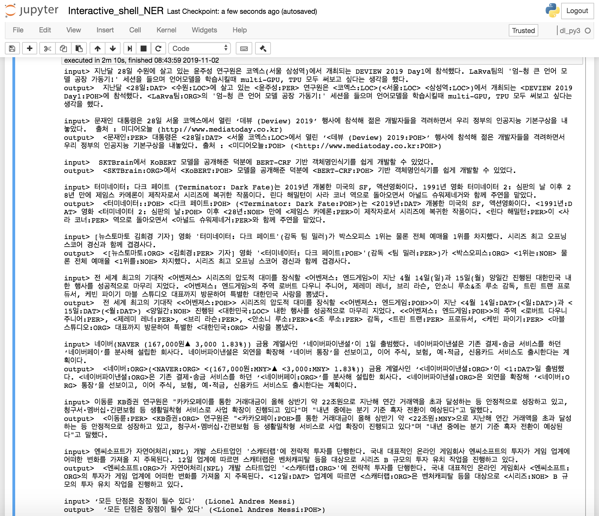

# Pytorch-BERT-CRF-NER

A PyTorch implementation of Korean NER Tagger based on BERT + CRF ((PyTorch v1.2 / Python 3.x)  


### Examples



### Logs
```
문장을 입력하세요: 지난 28일 수원에 살고 있는 윤주성 선임은 서울 삼성역에 있는 코엑스에서 DEVIEW 2019 Day1에 참석했다. LaRva팀의 '엄~청 큰 언어 모델 공장 가동기!' 세션을 들으며 언어모델을 학습시킬때 TPU도 써보고 싶다는 생각이 들었다.
len: 79, input_token:['[CLS]', '▁지난', '▁28', '일', '▁수원', '에', '▁살', '고', '▁있는', '▁윤', '주', '성', '▁선임', '은', '▁서울', '▁삼성', '역', '에', '▁있는', '▁코', '엑스', '에서', '▁D', 'E', 'V', 'I', 'E', 'W', '▁20', '19', '▁D', 'ay', '1', '에', '▁참석했다', '.', '▁L', 'a', 'R', 'v', 'a', '팀', '의', "▁'", '엄', '~', '청', '▁큰', '▁언', '어', '▁모델', '▁공장', '▁가동', '기', "!'", '▁세', '션', '을', '▁들', '으며', '▁언', '어', '모델', '을', '▁학습', '시킬', '때', '▁T', 'P', 'U', '도', '▁써', '보고', '▁싶다', '는', '▁생각이', '▁들었다', '.', '[SEP]']
len: 79, pred_ner_tag:['[CLS]', 'O', 'B-DAT', 'I-DAT', 'B-LOC', 'O', 'O', 'O', 'O', 'B-PER', 'I-PER', 'I-PER', 'O', 'O', 'B-LOC', 'B-LOC', 'I-LOC', 'O', 'O', 'B-LOC', 'I-LOC', 'O', 'B-POH', 'I-POH', 'I-POH', 'I-POH', 'I-POH', 'I-POH', 'I-POH', 'I-POH', 'I-POH', 'I-POH', 'I-POH', 'O', 'O', 'O', 'B-ORG', 'I-ORG', 'I-ORG', 'I-ORG', 'I-ORG', 'O', 'O', 'O', 'O', 'O', 'O', 'O', 'O', 'O', 'O', 'O', 'O', 'O', 'O', 'O', 'O', 'O', 'O', 'O', 'O', 'O', 'O', 'O', 'O', 'O', 'O', 'O', 'O', 'O', 'O', 'O', 'O', 'O', 'O', 'O', 'O', 'O', '[SEP]']
list_of_ner_word: [{'word': ' 28일', 'tag': 'DAT', 'prob': None}, {'word': ' 수원', 'tag': 'LOC', 'prob': None}, {'word': ' 윤주성', 'tag': 'PER', 'prob': None}, {'word': ' 삼성역', 'tag': 'LOC', 'prob': None}, {'word': ' 코엑스', 'tag': 'LOC', 'prob': None}, {'word': ' DEVIEW 2019 Day1', 'tag': 'POH', 'prob': None}, {'word': ' LaRva', 'tag': 'ORG', 'prob': None}]
decoding_ner_sentence: [CLS] 지난 <28일:DAT> <수원:LOC>에 살고 있는 <윤주성:PER> 선임은 <서울:LOC> <삼성역:LOC>에 있는 <코엑스:LOC>에서 <DEVIEW 2019 Day1:POH>에 참석했다. <LaRva:ORG>팀의 '엄~청 큰 언어 모델 공장 가동기!' 세션을 들으며 언어모델을 학습시킬때 TPU도 써보고 싶다는 생각이 들었다.[SEP]
   
문장을 입력하세요:  SKTBrain에서 KoBERT 모델을 공개해준 덕분에 BERT-CRF 기반 객체명인식기를 쉽게 개발할 수 있었다.
len: 40, input_token:['[CLS]', '▁SK', 'T', 'B', 'ra', 'in', '에서', '▁K', 'o', 'B', 'ER', 'T', '▁모델', '을', '▁공개', '해', '준', '▁덕분에', '▁B', 'ER', 'T', '-', 'C', 'R', 'F', '▁기반', '▁', '객', '체', '명', '인', '식', '기를', '▁쉽게', '▁개발', '할', '▁수', '▁있었다', '.', '[SEP]']
len: 40, pred_ner_tag:['[CLS]', 'B-ORG', 'I-ORG', 'I-ORG', 'I-ORG', 'I-ORG', 'O', 'B-POH', 'I-POH', 'I-POH', 'I-POH', 'I-POH', 'O', 'O', 'O', 'O', 'O', 'O', 'B-POH', 'I-POH', 'I-POH', 'I-POH', 'I-POH', 'I-POH', 'I-POH', 'O', 'O', 'O', 'O', 'O', 'O', 'O', 'O', 'O', 'O', 'O', 'O', 'O', 'O', '[SEP]']
list_of_ner_word: [{'word': ' SKTBrain', 'tag': 'ORG', 'prob': None}, {'word': ' KoBERT', 'tag': 'POH', 'prob': None}, {'word': ' BERT-CRF', 'tag': 'POH', 'prob': None}]
decoding_ner_sentence: [CLS] <SKTBrain:ORG>에서 <KoBERT:POH> 모델을 공개해준 덕분에 <BERT-CRF:POH> 기반 객체명인식기를 쉽게 개발할 수 있었다.[SEP]
```

### Note
- 엔티티를 토큰화할때 길이가 엔티티 자체보다 길어지는 경우, 정확한 엔티티 추출이 안될 수 있음 (토크나이저의 한계)
  - 이러한 경우에 대해서는 제외하고 학습할 수도 있지만, 더 넓은 범위를 커버하기 위해 포함하는 것으로 결정
  - e.g.)  첫 회를 시작으로 <13일:DAT>까지 -> ('▁13', 'B-DAT') ('일까지', 'I-DAT') (조사등이 같이 추출됨)
- 반대로 토큰화한 길이가 엔티티 자체보다 작은 경우 'I-tag' 토큰으로 해결가능
- pretrained sentencepiece를 사용하기 때문에 사전 변경은 안됨 (이것과 별개로 sp 사전을 변경 하는 방법은 따로 찾아봐야함) 
- pytorch-crf 라이브러리가 multi-gpu에서 안됨
  - 추후 변경

### Dataset
- [NER Dataset from 한국해양대학교 자연언어처리 연구실](https://github.com/kmounlp/NER)

### NER tagset
- 총 8개의 태그가 있음
    - PER: 사람이름
    - LOC: 지명
    - ORG: 기관명
    - POH: 기타
    - DAT: 날짜
    - TIM: 시간
    - DUR: 기간
    - MNY: 통화
    - PNT: 비율
    - NOH: 기타 수량표현
- 개체의 범주 
    - 개체이름: 사람이름(PER), 지명(LOC), 기관명(ORG), 기타(POH)
    - 시간표현: 날짜(DAT), 시간(TIM), 기간 (DUR)
    - 수량표현: 통화(MNY), 비율(PNT), 기타 수량표현(NOH)

### Requirements
```bash
pip install torch torchvision
pip install pytorch_pretrained_bert>=0.4.0
pip install mxnet>=1.5.0
pip install gluonnlp>=0.6.0
pip install sentencepiece>=0.1.6
pip install git+https://github.com/kmkurn/pytorch-crf#egg=pytorch_crf
```

### Model File Link
- [bert crf model file](https://drive.google.com/open?id=1FDLe3SUOVG7Xkh5mzstCWWTYZPtlOIK8)
- [bert_crf, bert_alone sharing folder](https://drive.google.com/drive/folders/1C6EKVpN5q1nENX2teqKuj_HHDfJoN47x?usp=sharing)

### train
```bash
python train_bert_crf.py 
```

### inference
```bash
python inference.py 
```

### Future work
- Validation pipeline
- NER tag probability 추가
- RestfulAPI 추가
- Refactoring, Refactoring, Refactoring

### Reference Repo
- [NLP implementation by aisolab](https://github.com/aisolab/nlp_implementation)
- [pytorch-crf](https://github.com/kmkurn/pytorch-crf/blob/8f3203a1f1d7984c87718bfe31853242670258db/docs/index.rst)
- [SKTBrain KoBERT](https://github.com/SKTBrain/KoBERT)