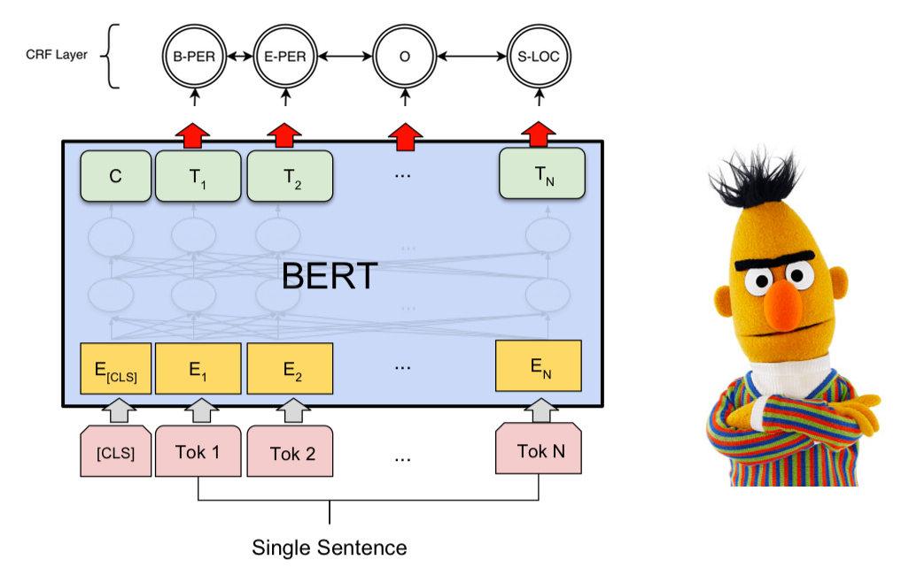
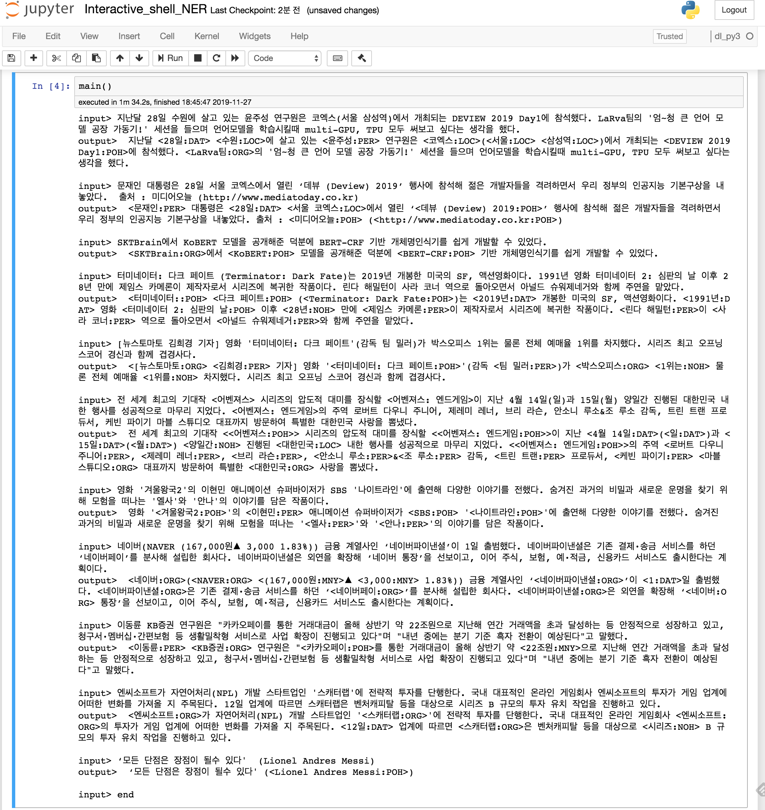
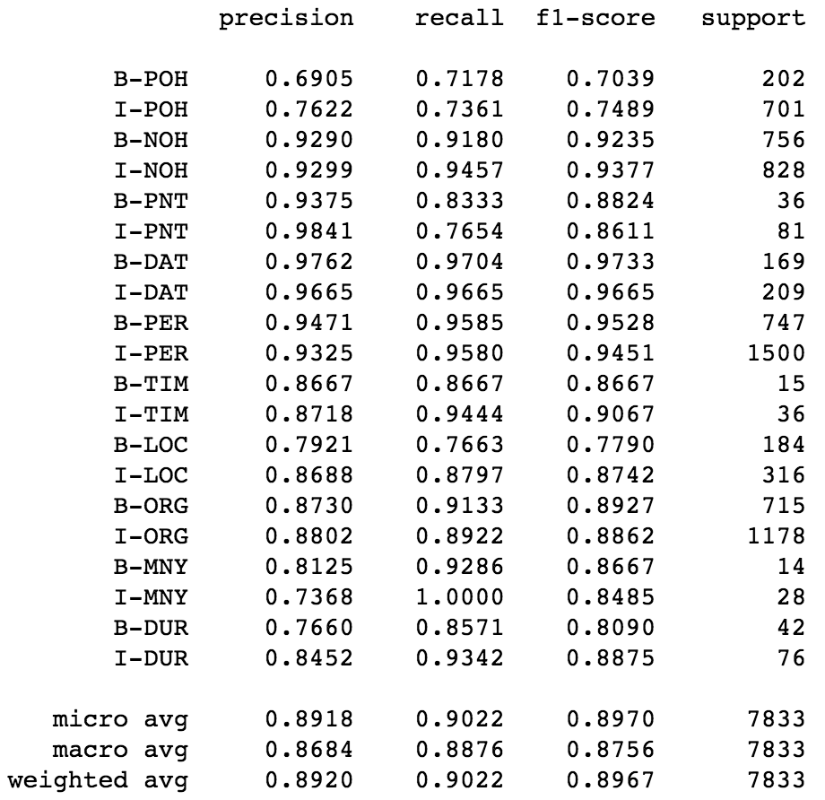
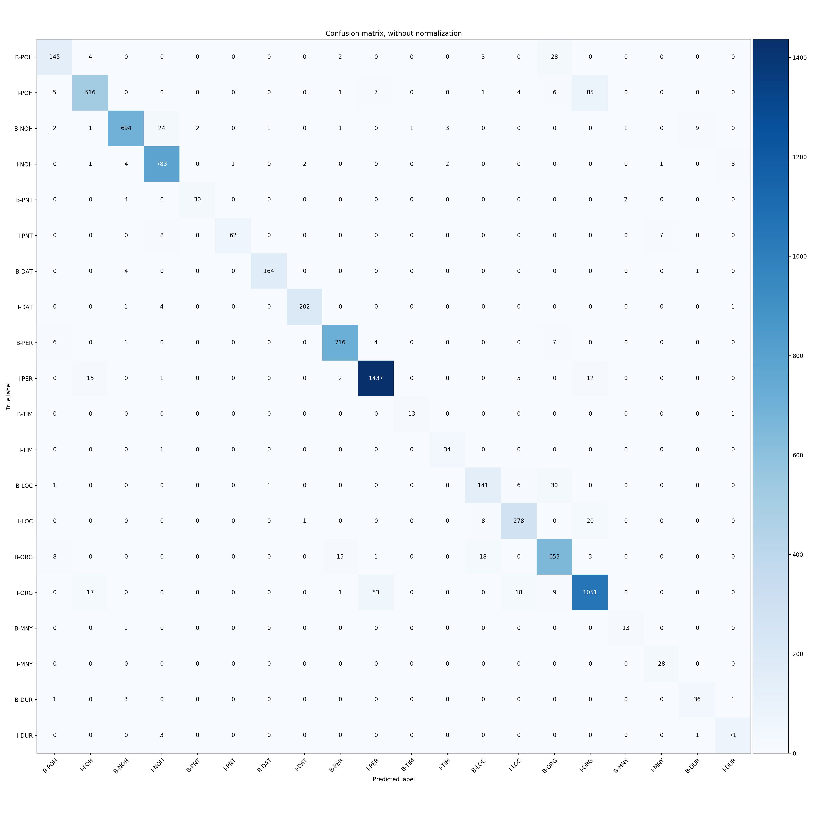
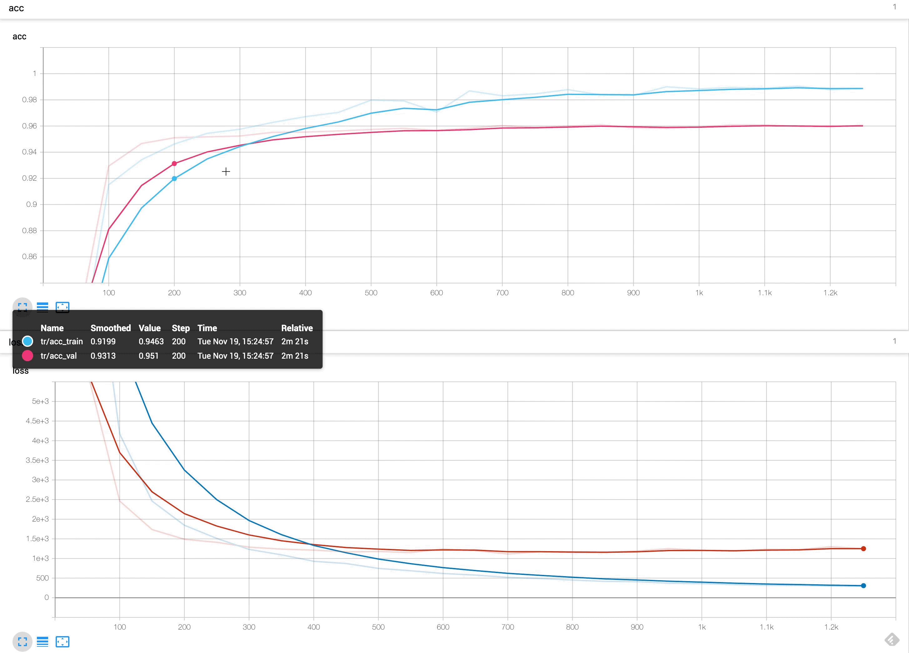

# Pytorch-BERT-CRF-NER

[](https://github.com/eagle705/pytorch-bert-crf-ner)

A PyTorch implementation of Korean NER Tagger based on BERT + CRF (PyTorch v1.2 / Python 3.x)  



### Examples



### Logs
```
문장을 입력하세요: 지난달 28일 수원에 살고 있는 윤주성 연구원은 코엑스(서울 삼성역)에서 개최되는 DEVIEW 2019 Day1에 참석했다. LaRva팀의 '엄~청 큰 언어 모델 공장 가동기!' 세션을 들으며 언어모델을 학습시킬때 multi-GPU, TPU 모두 써보고 싶다는 생각을 했다.
len: 90, input_token:['[CLS]', '▁지난달', '▁28', '일', '▁수원', '에', '▁살', '고', '▁있는', '▁윤', '주', '성', '▁연구원은', '▁코', '엑스', '(', '서울', '▁삼성', '역', ')', '에서', '▁개최', '되는', '▁D', 'E', 'V', 'I', 'E', 'W', '▁20', '19', '▁D', 'ay', '1', '에', '▁참석했다', '.', '▁L', 'a', 'R', 'v', 'a', '팀', '의', "▁'", '엄', '~', '청', '▁큰', '▁언', '어', '▁모델', '▁공장', '▁가동', '기', "!'", '▁세', '션', '을', '▁들', '으며', '▁언', '어', '모델', '을', '▁학습', '시킬', '때', '▁', 'm', 'ul', 't', 'i', '-', 'G', 'P', 'U', ',', '▁T', 'P', 'U', '▁모두', '▁써', '보고', '▁싶다', '는', '▁생각을', '▁했다', '.', '[SEP]']
len: 90, pred_ner_tag:['[CLS]', 'O', 'B-DAT', 'I-DAT', 'B-LOC', 'O', 'O', 'O', 'O', 'B-PER', 'I-PER', 'I-PER', 'O', 'B-LOC', 'I-LOC', 'O', 'B-LOC', 'B-LOC', 'I-LOC', 'O', 'O', 'O', 'O', 'B-POH', 'I-POH', 'I-POH', 'I-POH', 'I-POH', 'I-POH', 'I-POH', 'I-POH', 'I-POH', 'I-POH', 'I-POH', 'O', 'O', 'O', 'B-ORG', 'I-ORG', 'I-ORG', 'I-ORG', 'I-ORG', 'I-ORG', 'O', 'O', 'O', 'O', 'O', 'O', 'O', 'O', 'O', 'O', 'O', 'O', 'O', 'O', 'O', 'O', 'O', 'O', 'O', 'O', 'O', 'O', 'O', 'O', 'O', 'O', 'O', 'O', 'O', 'O', 'O', 'O', 'O', 'O', 'O', 'O', 'O', 'O', 'O', 'O', 'O', 'O', 'O', 'O', 'O', 'O', '[SEP]']
decoding_ner_sentence: [CLS] 지난달 <28일:DAT> <수원:LOC>에 살고 있는 <윤주성:PER> 연구원은 <코엑스:LOC>(<서울:LOC> <삼성역:LOC>)에서 개최되는 <DEVIEW 2019 Day1:POH>에 참석했다. <LaRva팀:ORG>의 '엄~청 큰 언어 모델 공장 가동기!' 세션을 들으며 언어모델을 학습시킬때 multi-GPU, TPU 모두 써보고 싶다는 생각을 했다.[SEP]
   
문장을 입력하세요: 문재인 대통령은 28일 서울 코엑스에서 열린 ‘데뷰 (Deview) 2019’ 행사에 참석해 젊은 개발자들을 격려하면서 우리 정부의 인공지능 기본구상을 내놓았다.  출처 : 미디어오늘 (http://www.mediatoday.co.kr)
len: 66, input_token:['[CLS]', '▁문재인', '▁대통령은', '▁28', '일', '▁서울', '▁코', '엑스', '에서', '▁열린', '▁‘', '데', '뷰', '▁(', 'D', 'e', 'v', 'i', 'e', 'w', ')', '▁20', '19', '’', '▁행사에', '▁참석해', '▁젊은', '▁개발', '자들', '을', '▁격려', '하면서', '▁우리', '▁정부의', '▁인', '공', '지', '능', '▁기본', '구', '상을', '▁내놓', '았다', '.', '▁출처', '▁:', '▁미디어', '오늘', '▁(', 'http', '://', 'www', '.', 'm', 'ed', 'i', 'at', 'o', 'd', 'ay', '.', 'co', '.', 'kr', ')', '[SEP]']
len: 66, pred_ner_tag:['[CLS]', 'B-PER', 'O', 'B-DAT', 'I-DAT', 'B-LOC', 'I-LOC', 'I-LOC', 'O', 'O', 'O', 'B-POH', 'I-POH', 'I-POH', 'I-POH', 'I-POH', 'I-POH', 'I-POH', 'I-POH', 'I-POH', 'I-POH', 'I-POH', 'I-POH', 'O', 'O', 'O', 'O', 'O', 'O', 'O', 'O', 'O', 'O', 'O', 'O', 'O', 'O', 'O', 'O', 'O', 'O', 'O', 'O', 'O', 'O', 'O', 'B-POH', 'I-POH', 'O', 'B-POH', 'I-POH', 'I-POH', 'I-POH', 'I-POH', 'I-POH', 'I-POH', 'I-POH', 'I-POH', 'I-POH', 'I-POH', 'I-POH', 'I-POH', 'I-POH', 'I-POH', 'O', '[SEP]']
decoding_ner_sentence: [CLS] <문재인:PER> 대통령은 <28일:DAT> <서울 코엑스:LOC>에서 열린 ‘<데뷰 (Deview) 2019:POH>’ 행사에 참석해 젊은 개발자들을 격려하면서 우리 정부의 인공지능 기본구상을 내놓았다. 출처 : <미디어오늘:POH> (<http://www.mediatoday.co.kr:POH>)[SEP]
   
문장을 입력하세요: SKTBrain에서 KoBERT 모델을 공개해준 덕분에 BERT-CRF 기반 개체명인식기를 쉽게 개발할 수 있었다.
len: 39, input_token:['[CLS]', '▁SK', 'T', 'B', 'ra', 'in', '에서', '▁K', 'o', 'B', 'ER', 'T', '▁모델', '을', '▁공개', '해', '준', '▁덕분에', '▁B', 'ER', 'T', '-', 'C', 'R', 'F', '▁기반', '▁개', '체', '명', '인', '식', '기를', '▁쉽게', '▁개발', '할', '▁수', '▁있었다', '.', '[SEP]']
len: 39, pred_ner_tag:['[CLS]', 'B-ORG', 'I-ORG', 'I-ORG', 'I-ORG', 'I-ORG', 'O', 'B-POH', 'I-POH', 'I-POH', 'I-POH', 'I-POH', 'O', 'O', 'O', 'O', 'O', 'O', 'B-POH', 'I-POH', 'I-POH', 'I-POH', 'I-POH', 'I-POH', 'I-POH', 'O', 'O', 'O', 'O', 'O', 'O', 'O', 'O', 'O', 'O', 'O', 'O', 'O', '[SEP]']
decoding_ner_sentence: [CLS] <SKTBrain:ORG>에서 <KoBERT:POH> 모델을 공개해준 덕분에 <BERT-CRF:POH> 기반 개체명인식기를 쉽게 개발할 수 있었다.[SEP]
   
문장을 입력하세요: 터미네이터: 다크 페이트 (Terminator: Dark Fate)는 2019년 개봉한 미국의 SF, 액션영화이다. 1991년 영화 터미네이터 2: 심판의 날 이후 28년 만에 제임스 카메론이 제작자로서 시리즈에 복귀한 작품이다. 린다 해밀턴이 사라 코너 역으로 돌아오면서 아널드 슈워제네거와 함께 주연을 맡았다.
len: 102, input_token:['[CLS]', '▁터', '미', '네', '이', '터', ':', '▁다', '크', '▁페', '이', '트', '▁(', 'T', 'er', 'm', 'in', 'at', 'or', ':', '▁D', 'ar', 'k', '▁F', 'at', 'e', ')', '는', '▁20', '19', '년', '▁개봉', '한', '▁미국의', '▁S', 'F', ',', '▁액션', '영화', '이다', '.', '▁19', '91', '년', '▁영화', '▁터', '미', '네', '이', '터', '▁2', ':', '▁심판', '의', '▁날', '▁이후', '▁28', '년', '▁만에', '▁제임스', '▁카', '메', '론', '이', '▁제작', '자', '로서', '▁시리즈', '에', '▁복귀', '한', '▁작품', '이다', '.', '▁', '린다', '▁해', '밀', '턴', '이', '▁사', '라', '▁코너', '▁역', '으로', '▁돌아오', '면서', '▁아', '널', '드', '▁슈', '워', '제', '네', '거', '와', '▁함께', '▁주연', '을', '▁맡았다', '.', '[SEP]']
len: 102, pred_ner_tag:['[CLS]', 'B-POH', 'I-POH', 'I-POH', 'I-POH', 'I-POH', 'I-POH', 'B-POH', 'I-POH', 'I-POH', 'I-POH', 'I-POH', 'O', 'B-POH', 'I-POH', 'I-POH', 'I-POH', 'I-POH', 'I-POH', 'I-POH', 'I-POH', 'I-POH', 'I-POH', 'I-POH', 'I-POH', 'I-POH', 'O', 'O', 'B-DAT', 'I-DAT', 'I-DAT', 'O', 'O', 'O', 'O', 'O', 'O', 'O', 'O', 'O', 'O', 'B-DAT', 'I-DAT', 'I-DAT', 'O', 'B-POH', 'I-POH', 'I-POH', 'I-POH', 'I-POH', 'I-POH', 'I-POH', 'I-POH', 'I-POH', 'I-POH', 'O', 'B-NOH', 'I-DUR', 'O', 'B-PER', 'I-PER', 'I-PER', 'I-PER', 'O', 'O', 'O', 'O', 'O', 'O', 'O', 'O', 'O', 'O', 'O', 'B-PER', 'I-PER', 'I-PER', 'I-PER', 'I-PER', 'O', 'B-PER', 'I-PER', 'I-PER', 'O', 'O', 'O', 'O', 'B-PER', 'I-PER', 'I-PER', 'I-PER', 'I-PER', 'I-PER', 'I-PER', 'I-PER', 'O', 'O', 'O', 'O', 'O', 'O', '[SEP]']
decoding_ner_sentence: [CLS] <터미네이터::POH> <다크 페이트:POH> (<Terminator: Dark Fate:POH>)는 <2019년:DAT> 개봉한 미국의 SF, 액션영화이다. <1991년:DAT> 영화 <터미네이터 2: 심판의 날:POH> 이후 <28년:NOH> 만에 <제임스 카메론:PER>이 제작자로서 시리즈에 복귀한 작품이다. <린다 해밀턴:PER>이 <사라 코너:PER> 역으로 돌아오면서 <아널드 슈워제네거:PER>와 함께 주연을 맡았다.[SEP]
   
문장을 입력하세요: 전 세계 최고의 기대작 <어벤져스> 시리즈의 압도적 대미를 장식할 <어벤져스: 엔드게임>이 지난 4월 14일(일)과 15일(월) 양일간 진행된 대한민국 내한 행사를 성공적으로 마무리 지었다. <어벤져스: 엔드게임>의 주역 로버트 다우니 주니어, 제레미 레너, 브리 라슨, 안소니 루소&조 루소 감독, 트린 트랜 프로듀서, 케빈 파이기 마블 스튜디오 대표까지 방문하여 특별한 대한민국 사랑을 뽐냈다.
len: 134, input_token:['[CLS]', '▁전', '▁세계', '▁최고의', '▁기대', '작', '▁<', '어', '벤', '져', '스', '>', '▁시리즈', '의', '▁압도적', '▁대', '미', '를', '▁장', '식', '할', '▁<', '어', '벤', '져', '스', ':', '▁엔', '드', '게임', '>', '이', '▁지난', '▁4', '월', '▁14', '일', '(', '일', ')', '과', '▁15', '일', '(', '월', ')', '▁양', '일간', '▁진행된', '▁대한민국', '▁내', '한', '▁행사를', '▁성공', '적으로', '▁마무리', '▁지', '었다', '.', '▁<', '어', '벤', '져', '스', ':', '▁엔', '드', '게임', '>', '의', '▁주', '역', '▁', '로', '버', '트', '▁다', '우', '니', '▁주', '니', '어', ',', '▁제', '레', '미', '▁레', '너', ',', '▁', '브리', '▁라', '슨', ',', '▁안', '소', '니', '▁루', '소', '&', '조', '▁루', '소', '▁감독', ',', '▁트', '린', '▁트', '랜', '▁프로', '듀', '서', ',', '▁케', '빈', '▁파', '이', '기', '▁마', '블', '▁스', '튜', '디', '오', '▁대표', '까지', '▁방문', '하여', '▁특별한', '▁대한민국', '▁사랑을', '▁뽐냈다', '.', '[SEP]']
len: 134, pred_ner_tag:['[CLS]', 'O', 'O', 'O', 'O', 'O', 'O', 'B-POH', 'I-POH', 'I-POH', 'I-POH', 'O', 'O', 'O', 'O', 'O', 'O', 'O', 'O', 'O', 'O', 'O', 'B-POH', 'I-POH', 'I-POH', 'I-POH', 'I-POH', 'I-POH', 'I-POH', 'I-POH', 'O', 'O', 'O', 'B-DAT', 'I-DAT', 'I-DAT', 'I-DAT', 'O', 'B-DAT', 'O', 'O', 'B-DAT', 'I-DAT', 'O', 'B-DAT', 'O', 'B-NOH', 'I-NOH', 'O', 'B-LOC', 'O', 'O', 'O', 'O', 'O', 'O', 'O', 'O', 'O', 'O', 'B-POH', 'I-POH', 'I-POH', 'I-POH', 'I-POH', 'I-POH', 'I-POH', 'I-POH', 'O', 'O', 'O', 'O', 'B-PER', 'I-PER', 'I-PER', 'I-PER', 'I-PER', 'I-PER', 'I-PER', 'I-PER', 'I-PER', 'I-PER', 'O', 'B-PER', 'I-PER', 'I-PER', 'I-PER', 'I-PER', 'O', 'B-PER', 'I-PER', 'I-PER', 'I-PER', 'O', 'B-PER', 'I-PER', 'I-PER', 'I-PER', 'I-PER', 'O', 'B-PER', 'I-PER', 'I-PER', 'O', 'O', 'B-PER', 'I-PER', 'I-PER', 'I-PER', 'O', 'O', 'O', 'O', 'B-PER', 'I-PER', 'I-PER', 'I-PER', 'I-PER', 'B-ORG', 'I-ORG', 'I-ORG', 'I-ORG', 'I-ORG', 'I-ORG', 'O', 'O', 'O', '[SEP]', 'O', 'B-ORG', 'O', 'O', 'O', '[SEP]']
decoding_ner_sentence: [CLS] 전 세계 최고의 기대작 <<어벤져스:POH>> 시리즈의 압도적 대미를 장식할 <<어벤져스: 엔드게임:POH>>이 지난 <4월 14일:DAT>(<일:DAT>)과 <15일:DAT>(<월:DAT>) <양일간:NOH> 진행된 <대한민국:LOC> 내한 행사를 성공적으로 마무리 지었다. <<어벤져스: 엔드게임:POH>>의 주역 <로버트 다우니 주니어:PER>, <제레미 레너:PER>, <브리 라슨:PER>, <안소니 루소:PER>&<조 루소:PER> 감독, <트린 트랜:PER> 프로듀서, <케빈 파이기:PER> <마블 스튜디오:ORG> 대표까지 방문하여 특별한 <대한민국:ORG> 사랑을 뽐냈다.[SEP]
   
문장을 입력하세요: ‘모든 단점은 장점이 될수 있다'  (Lionel Andres Messi)
len: 29, input_token:['[CLS]', '▁‘', '모', '든', '▁단', '점', '은', '▁장점', '이', '▁될', '수', '▁있다', "'", '▁(', 'L', 'i', 'on', 'el', '▁A', 'n', 'd', 're', 's', '▁M', 'es', 's', 'i', ')', '[SEP]']
len: 29, pred_ner_tag:['[CLS]', 'O', 'O', 'O', 'O', 'O', 'O', 'O', 'O', 'O', 'O', 'O', 'O', 'O', 'B-POH', 'I-POH', 'I-PER', 'I-POH', 'I-POH', 'I-POH', 'I-PER', 'I-PER', 'I-PER', 'I-PER', 'I-PER', 'I-PER', 'I-PER', 'O', '[SEP]']
decoding_ner_sentence: [CLS] ‘모든 단점은 장점이 될수 있다' (<Lionel Andres Messi:POH>)[SEP]
```

### Note
- 엔티티를 토큰화할때 토큰의 길이가 엔티티 자체보다 길어지는 경우, 정확한 엔티티 추출이 안될 수 있음 (토크나이저의 한계)
  - 이러한 경우에 대해서는 제외하고 학습할 수도 있지만, 더 넓은 범위를 커버하기 위해 포함하는 것으로 결정
  - e.g.)  첫 회를 시작으로 <13일:DAT>까지 -> ('▁13', 'B-DAT') ('일까지', 'I-DAT') (조사등이 같이 추출됨)
- 반대로 토큰화한 길이가 엔티티 자체보다 작은 경우 'I-tag' 토큰으로 해결가능
- pretrained sentencepiece를 사용하기 때문에 사전 변경은 안됨 (이것과 별개로 sp 사전을 변경 하는 방법은 따로 찾아봐야함) 
- pytorch-crf 라이브러리가 multi-gpu에서 안됨
  - 추후 변경
- BERT가 LM기반이라 그런지 오타에도 어느정도 강건한 편인듯함
- 문장 길이에 따라 NER 결과가 달라짐
- 영어 데이터에 대해서는 학습이 안되서 잘 안됨
- 사전에 나오는 '▁' 토큰과 우리가 흔히 사용하는 underscore '_'는 다르므로 주의할 것
- B 태그의 NER과 I 태그의 NER이 다를 경우를 방지하기 위해 BERT+Bi(LSTM or GRU)+CRF 구조로도 테스트 해봄
  - 장점 
    - 엔티티 토큰의 길이가 긴 경우는 잘 잡아냄
    - B 태그의 NER과 I 태그의 NER이 다른 경우가 확실히 줄어듬
  - 단점
    - 모델 사이즈가 커진다는 것
    - B 태그의 위치를 잘 못잡는 경우가 발생함  <12일:DAT>로 잡아야되는걸 앞문장의 구두점을 포함해서 <. 12일:DAT>로 잡거나, <1.83%:PNT>으로 잡아야 되는걸 1.8<3%:PNT> 잡기도함
  - 느낀점
    - B 태그 위치를 잘못잡는것 때문에 쓰기가 약간 애매하다는 생각이 듬 (보완이 필요함)
    - 학습은 GRU가 LSTM 보다 1 epoch정도 더 빠르게 성능이 올라감
- If you want to apply it to other languages, you don't have to change the model architecture. Instead, you just change vocab, pretrained BERT(from huggingface), and training dataset.

### Dataset
- [NER Dataset from 한국해양대학교 자연언어처리 연구실](https://github.com/kmounlp/NER)

### NER tagset
- 총 8개의 태그가 있음
    - PER: 사람이름
    - LOC: 지명
    - ORG: 기관명
    - POH: 기타
    - DAT: 날짜
    - TIM: 시간
    - DUR: 기간
    - MNY: 통화
    - PNT: 비율
    - NOH: 기타 수량표현
- 개체의 범주 
    - 개체이름: 사람이름(PER), 지명(LOC), 기관명(ORG), 기타(POH)
    - 시간표현: 날짜(DAT), 시간(TIM), 기간 (DUR)
    - 수량표현: 통화(MNY), 비율(PNT), 기타 수량표현(NOH)

### Results
- Epoch: 12 (without early stopping)
- num of train: 23032, num of val: 931
- Training set: ```00002_NER.txt```, ..., ```EXOBRAIN_NE_CORPUS_007.txt``` (1,425 files)
- Validation set: ```EXOBRAIN_NE_CORPUS_009.txt```, ```EXOBRAIN_NE_CORPUS_010.txt``` (2 files)

- Classification Report
  - 대체적으로 DAT, PER, NOH, ORG, PNT 순으로 높음
  - POH, LOC등은 좀 낮은 편
  - validation set 기준, macro avg F1: 87.56


- Confusion Matrix
  - POH를 ORG로 예측하는 경우가 있음 (기타를 기관으로 분류하는 거니 어느정도 그럴 수 있다고 생각)
  - ORG를 PER로 예측하는 경우도 좀 있음 (수정해야되는 케이스)


- Training & Evaluation Accurcay & Loss Graph


- Benchmark (Devset F1 scroe )

|Model|MacroAvg F1 score|Epoch|Date|
|:------:|:------:|:---:|:---:|
|KoBERT|0.8554|12|191129|
|**KoBERT+CRF**|**0.8756**|12|191129|
|KoBERT+BiLSTM+CRF|0.8659|12|191129|


### Requirements
```bash
pip install torch torchvision
pip install pytorch_pretrained_bert>=0.4.0
pip install mxnet>=1.5.0
pip install gluonnlp>=0.6.0
pip install sentencepiece>=0.1.6
pip install git+https://github.com/kmkurn/pytorch-crf#egg=pytorch_crf
pip install transformers
pip install tb-nightly
pip install future
```

### Model File Link
- [BERT CRF model file with validation](https://drive.google.com/file/d/1ZkWeR0gXPrUrOHe-xt4Im_Z9AXWFXmk7/view?usp=sharing)
- [BERT CRF model file with training all dataset](https://drive.google.com/open?id=1FDLe3SUOVG7Xkh5mzstCWWTYZPtlOIK8)
- [BERT CRF, BERT_alone sharing folder (including BiLSTM, BiGRU)](https://drive.google.com/drive/folders/1C6EKVpN5q1nENX2teqKuj_HHDfJoN47x?usp=sharing)

### train
```bash
python train_bert_crf.py 
```

### inference
```bash
python inference.py 
```

### Visualization


### Future work
- ~~Validation pipeline~~
- NER tag probability
- RestfulAPI
- Knowledge Distillation
- Apex fp16 half-precision
- Refactoring, Refactoring, Refactoring

### Reference Repo
- [NLP implementation by aisolab](https://github.com/aisolab/nlp_implementation)
- [pytorch-crf](https://github.com/kmkurn/pytorch-crf/blob/8f3203a1f1d7984c87718bfe31853242670258db/docs/index.rst)
- [SKTBrain KoBERT](https://github.com/SKTBrain/KoBERT)
- [Finetuning configuration from huggingface](https://github.com/huggingface/pytorch-transformers/blob/master/examples/run_multiple_choice.py)
- [BERT Attention Visualization](https://github.com/jessevig/bertviz)